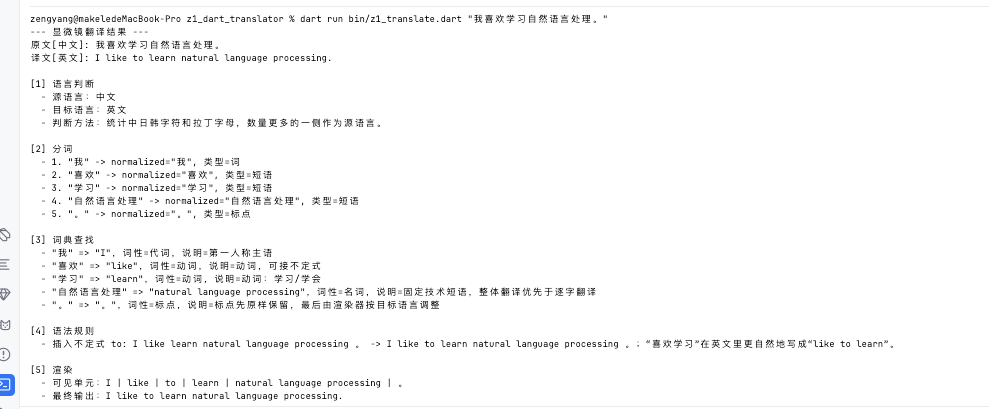

# z1_dart_translator
一个最原始方便学习的翻译引擎，无需联网，算法完整，展示全过程。

## 它是什么

这个项目是一个“显微镜式”的中英双向微型翻译引擎。它不追求像在线翻译一样覆盖所有语言现象，而是把翻译过程拆成可以观察、可以学习的步骤：语言判断、分词、词典查找、语法规则、最终渲染。

更完整的算法讲解见：[docs/translation_engine.md](docs/translation_engine.md)。

## 运行入口

翻译学习引擎入口是：

```bash
bin/z1_translate.dart
```

运行显微镜翻译引擎：

```bash
dart run bin/z1_translate.dart "我喜欢学习自然语言处理。"
```

也可以指定方向：

```bash
dart run bin/z1_translate.dart --from=en --to=zh "I like to learn natural language processing."
```

这个翻译引擎不是联网翻译器，而是一个方便学习的中英双向微型 NLP 流水线。它会展示：

1. 语言判断。
2. 分词。
3. 词典查找。
4. 语法规则，例如省略中文助词、英文 `be` 变形、插入 `to` 和冠词。
5. 最终渲染。

## 源码阅读顺序

建议按下面的顺序阅读：

1. `bin/z1_translate.dart`：命令行入口。
2. `lib/engine.dart`：翻译流水线总调度。
3. `lib/language.dart`：语言判断。
4. `lib/token.dart` 和 `lib/tokenizer.dart`：token 类型和分词算法。
5. `lib/lexicon.dart` 和 `lib/analyzer.dart`：词典和词典分析。
6. `lib/translation_unit.dart` 和 `lib/rules.dart`：翻译单元和语法规则。
7. `lib/renderer.dart`：目标语言渲染。
8. `lib/result.dart`：显微镜报告。


